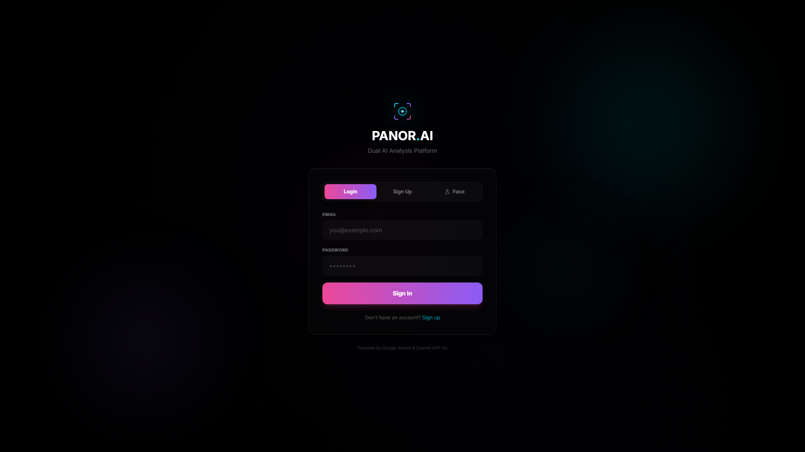
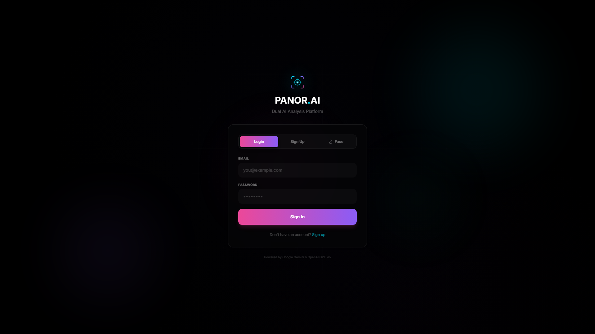
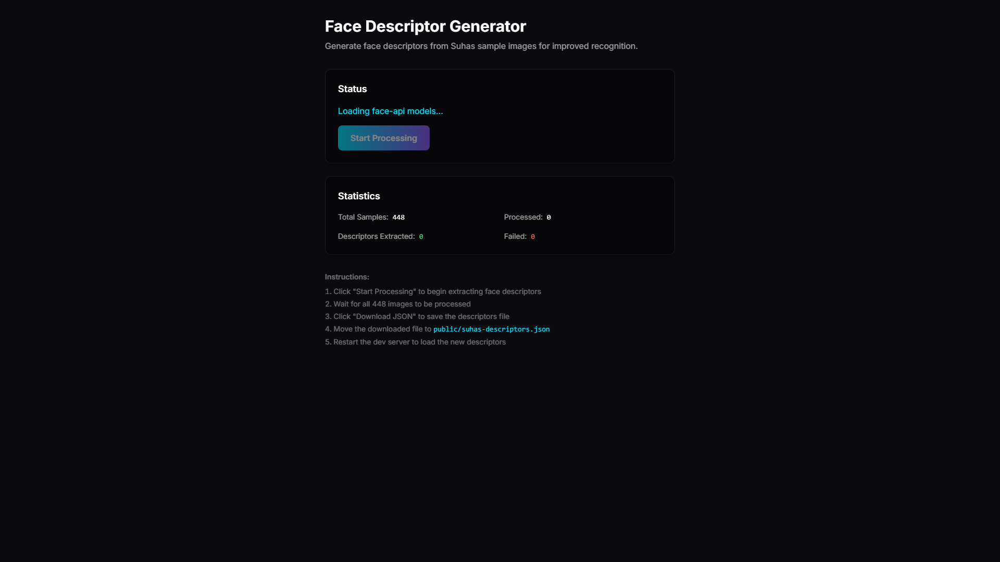

# AI Document Analyzer

A production-ready web application that analyzes documents using both Google Gemini and OpenAI ChatGPT, providing intelligent answers with a final summarized response combining the best of both AI models.

## Features

- **Multi-Format Support**: Upload PDF, PNG, JPG, DOCX, and TXT files
- **Dual AI Analysis**: Get responses from both Gemini and ChatGPT
- **Smart Summarization**: Receive a final answer that combines and refines both responses
- **Modern UI**: Clean, responsive interface with dark mode support
- **Real-time Processing**: Progress indicators and status updates
- **Secure**: File size limits, type validation, and automatic cleanup
- **Production-Ready**: Error handling, logging, and best practices

## Screenshots

### Login Page


### Face Detection


### Object Detection


### Live Streaming


### Face Descriptor Generator


## Tech Stack

### Frontend
- **Framework**: Next.js 14 (App Router)
- **Styling**: Tailwind CSS
- **UI Components**: React with TypeScript
- **File Upload**: react-dropzone
- **Dark Mode**: next-themes

### Backend
- **Runtime**: Node.js
- **API Routes**: Next.js API Routes
- **File Processing**:
  - PDF: pdf-parse
  - Images: Tesseract.js (OCR)
  - DOCX: mammoth
  - TXT: Node.js fs
- **AI Integration**:
  - Google Gemini API
  - OpenAI API
- **Logging**: Winston

## Prerequisites

- Node.js 18+ installed
- OpenAI API key
- Google Gemini API key
- npm or yarn package manager

## Installation

### 1. Clone or Download

```bash
cd ai-document-analyzer
```

### 2. Install Dependencies

```bash
npm install
# or
yarn install
```

### 3. Environment Configuration

Create a `.env` file in the root directory:

```bash
cp .env.example .env
```

Edit `.env` and add your API keys:

```env
# OpenAI Configuration
OPENAI_API_KEY=sk-your-openai-api-key-here

# Google Gemini Configuration
GEMINI_API_KEY=your-gemini-api-key-here

# Application Configuration
NODE_ENV=development
MAX_FILE_SIZE=10485760
ALLOWED_FILE_TYPES=.pdf,.png,.jpg,.jpeg,.docx,.txt

# API Timeouts (in milliseconds)
API_TIMEOUT=60000

# Rate Limiting (requests per minute)
RATE_LIMIT=10
```

### 4. Get API Keys

#### OpenAI API Key
1. Visit https://platform.openai.com/api-keys
2. Sign up or log in
3. Click "Create new secret key"
4. Copy the key and add it to `.env`

#### Google Gemini API Key
1. Visit https://makersuite.google.com/app/apikey
2. Sign in with your Google account
3. Click "Create API Key"
4. Copy the key and add it to `.env`

## Development

Run the development server:

```bash
npm run dev
# or
yarn dev
```

Open [http://localhost:3000](http://localhost:3000) in your browser.

## Production Build

Build the application:

```bash
npm run build
# or
yarn build
```

Start the production server:

```bash
npm start
# or
yarn start
```

## Project Structure

```
ai-document-analyzer/
├── app/
│   ├── api/
│   │   ├── analyze/
│   │   │   └── route.ts          # Main analysis endpoint
│   │   └── health/
│   │       └── route.ts           # Health check endpoint
│   ├── globals.css                # Global styles
│   ├── layout.tsx                 # Root layout with theme provider
│   └── page.tsx                   # Main page component
├── components/
│   ├── FileUpload.tsx             # File upload UI
│   ├── Header.tsx                 # Header with dark mode toggle
│   ├── ResponseDisplay.tsx        # AI responses display
│   └── ThemeProvider.tsx          # Theme context provider
├── lib/
│   ├── ai/
│   │   ├── geminiService.ts       # Gemini API integration
│   │   ├── openaiService.ts       # OpenAI API integration
│   │   └── index.ts               # Combined AI orchestration
│   ├── parsers/
│   │   ├── pdfParser.ts           # PDF text extraction
│   │   ├── imageParser.ts         # OCR for images
│   │   ├── docxParser.ts          # DOCX text extraction
│   │   ├── textParser.ts          # Text file reader
│   │   └── index.ts               # Parser orchestration
│   ├── config.ts                  # Configuration management
│   ├── fileUpload.ts              # File upload handling
│   └── logger.ts                  # Winston logger setup
├── .env.example                   # Environment template
├── .gitignore                     # Git ignore rules
├── next.config.js                 # Next.js configuration
├── package.json                   # Dependencies
├── tailwind.config.ts             # Tailwind configuration
└── tsconfig.json                  # TypeScript configuration
```

## API Endpoints

### POST /api/analyze

Analyzes an uploaded document with AI.

**Request:**
- Content-Type: `multipart/form-data`
- Fields:
  - `file`: Document file (PDF, PNG, JPG, DOCX, TXT)
  - `question`: Question to ask about the document

**Response:**
```json
{
  "success": true,
  "data": {
    "file": {
      "name": "document.pdf",
      "size": 12345,
      "type": "application/pdf"
    },
    "extractedText": "Preview of extracted text...",
    "question": "What is the main topic?",
    "responses": {
      "gemini": {
        "text": "Gemini's response...",
        "model": "gemini-1.5-pro",
        "timestamp": "2024-01-01T00:00:00.000Z"
      },
      "chatgpt": {
        "text": "ChatGPT's response...",
        "model": "gpt-4-turbo-preview",
        "timestamp": "2024-01-01T00:00:00.000Z"
      },
      "summary": {
        "text": "Final summarized answer...",
        "model": "gpt-4-turbo-preview (Summarizer)",
        "timestamp": "2024-01-01T00:00:00.000Z"
      }
    }
  }
}
```

### GET /api/health

Health check endpoint.

**Response:**
```json
{
  "status": "healthy",
  "timestamp": "2024-01-01T00:00:00.000Z",
  "config": {
    "maxFileSize": 10485760,
    "allowedFileTypes": [".pdf", ".png", ".jpg", ".jpeg", ".docx", ".txt"],
    "hasOpenAIKey": true,
    "hasGeminiKey": true
  }
}
```

## Usage

1. **Upload a Document**
   - Drag and drop or click to select a file
   - Supported formats: PDF, PNG, JPG, DOCX, TXT
   - Maximum size: 10MB

2. **Ask a Question**
   - Enter your question in the text area
   - Be specific for better results

3. **View Results**
   - Gemini AI response
   - ChatGPT response
   - Final summarized answer combining both

4. **Analyze Another Document**
   - Click "Analyze Another Document" to start over

## Security Best Practices

- **API Keys**: Never commit `.env` file to version control
- **File Validation**: Only allowed file types are processed
- **File Size Limits**: Maximum 10MB per file
- **Automatic Cleanup**: Uploaded files are deleted after processing
- **Error Handling**: Sensitive information is not exposed in error messages
- **Rate Limiting**: Consider implementing rate limiting in production
- **HTTPS**: Always use HTTPS in production
- **CORS**: Configure CORS policies for production

## Performance Optimization

- **Parallel Processing**: Gemini and ChatGPT are called simultaneously
- **File Cleanup**: Automatic deletion of temporary files
- **Caching**: Consider implementing response caching for repeated queries
- **CDN**: Use CDN for static assets in production
- **Image Optimization**: Next.js automatic image optimization

## Error Handling

The application handles various error scenarios:

- Invalid file types
- File size exceeded
- Missing API keys
- API timeouts
- Text extraction failures
- Network errors

All errors are logged and displayed to users in a user-friendly format.

## Logging

Winston logger is configured with:
- **Development**: Console output with colors
- **Production**: File-based logging (error.log, combined.log)
- Log levels: error, warn, info, debug

## Troubleshooting

### API Key Issues
- Verify keys are correctly set in `.env`
- Check for extra spaces or quotes
- Ensure keys have proper permissions

### File Upload Issues
- Check file size (max 10MB)
- Verify file type is supported
- Ensure uploads directory has write permissions

### OCR Issues
- Tesseract.js requires good image quality
- Try higher resolution images
- Ensure text is clearly visible

### Build Errors
- Delete `.next` folder and rebuild
- Clear npm cache: `npm cache clean --force`
- Delete `node_modules` and reinstall

## Contributing

1. Fork the repository
2. Create a feature branch
3. Commit your changes
4. Push to the branch
5. Create a Pull Request

## License

MIT License - feel free to use this project for personal or commercial purposes.

## Support

For issues, questions, or suggestions, please open an issue on GitHub.

## Acknowledgments

- Google Gemini for powerful AI capabilities
- OpenAI for ChatGPT API
- Next.js team for the excellent framework
- Open source community for all the libraries used
